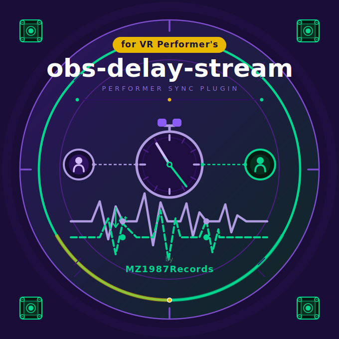

# obs-delay-stream  v4.1.0

OBSにパフォーマー向けWebSocket配信機能を追加するプラグインです。各パフォーマーへの遅延時間が自動計測され、タイミングが揃うように自動調整されます。IP隠蔽トンネル機能つき。

[BOOTH](https://mz1987records.booth.pm/items/8134637) | [バグ報告](https://github.com/MZ1987Records/obs-delay-stream/issues/new/choose)

<p align="center">
  
</p>

---

## 機能一覧

| 機能セクション | 内容 |
|------|------|
| 演者別チャンネル設定 | 演者ごとの名前を管理します。詳細編集モードでは個別に同期設定を調整できます |
| 配信ID / IP | 配信IDとホストIPは自動設定されます。詳細モードではホストIPを手動設定できます |
| WebSocket | 配信サーバーの起動・停止と送信制御を行います |
| トンネル | cloudflared で公開URLを発行します。IPを直接公開せずに外部共有できます |
| URL配布 | 演者用URLの一括コピーができます。共有時の手間や配布ミスを減らせます |
| 同期フロー | 演者側・RTMP側の遅延を2ステップで計測・反映します。案内に沿って全体のタイミングを揃えられます |
| マスター / RTMP | マスター遅延の手動調整とRTMP計測結果の適用ができます。配信経路を含めたズレの微調整に使えます |
| 全体オフセット | 全チャンネルへ共通オフセットを加算します。最終的な体感差をまとめて補正できます |

---

## インストール

1. [Releases](https://github.com/MZ1987Records/obs-delay-stream/releases) または [BOOTH](https://mz1987records.booth.pm/items/8134637) から最新の `obs-delay-stream-vX.X.X.zip` をダウンロードして解凍
2. ZIP内に `For ProgramData` と `For Program Files (legacy)` の2種類が入っています。使用中のOBS配置に合わせて選択してください

### ProgramData 配置（推奨）

1. `For ProgramData/plugins/obs-delay-stream` を以下へ配置:

```
C:\ProgramData\obs-studio\plugins\
```

2. OBS Studio を再起動

### Program Files 配置（レガシー）

1. `For Program Files (legacy)/obs-plugins/64bit/obs-delay-stream.dll` を以下へ配置:

```
C:\Program Files\obs-studio\obs-plugins\64bit\
```

2. `For Program Files (legacy)/data/obs-plugins/obs-delay-stream` を以下へ配置:

```
C:\Program Files\obs-studio\data\obs-plugins\
```

3. 既存ファイルがある場合は上書きでOKです（更新の場合）
4. OBS Studio を再起動（管理者権限が必要な場合があります）

### 動作確認

1. OBS Studio を起動
2. 音声ソース（マイク・デスクトップ音声など）を右クリック
3. **フィルター** → **＋** → **「obs-delay-stream」** を選択
4. GUIパネルが開けばインストール成功

---

## 使い方

### 初期設定

1. フィルターパネルを開く
2. **演者別チャンネル設定** で各パフォーマーの名前を入力
3. **WebSocketサーバー起動** ボタンを押す

### トンネル使用時（IP隠蔽・推奨）

1. `cloudflared.exe path` は `auto` のままでOK（カスタム指定したい場合のみ exe のパスを入力）
2. 「トンネルを起動」ボタンを押す（デフォルトでは初回に exe が自動ダウンロードされる）
3. `https://xxxx.trycloudflare.com` 形式のURLが発行される

> **注意:** セキュリティソフトが `*.trycloudflare.com` をブロックしてトンネル接続に失敗することがあります。
> その場合は `*.trycloudflare.com` を例外（許可）に追加してください。

※ 自動ダウンロードされた exe の保存先:
`%LOCALAPPDATA%\obs-delay-stream\bin\cloudflared.exe`

### パフォーマーへの接続案内

**演者用URL一覧をコピー** ボタンを押し、Discordなどにペーストして共有する。
各パフォーマーに、対応する自分のURLを開いてもらう。

### 同期フロー（推奨手順）

1. 全パフォーマーが受信ページに接続済みであることを確認
2. 「同期フロー開始」ボタンを押す
3. Step1: 自動計測完了後、各CHの基準遅延が自動適用されることを確認
4. Step2: RTMP計測完了後、マスター遅延を確認して「反映して完了」

---

## 開発者向け情報

ビルド手順・トラブルシューティング・ファイル構成については [BUILDING.md](BUILDING.md) を参照してください。

---

## ライセンス

[GNU General Public License v2.0 or later](LICENSE) — サードパーティライセンスについては [THIRD_PARTY_NOTICES](THIRD_PARTY_NOTICES) を参照してください。
