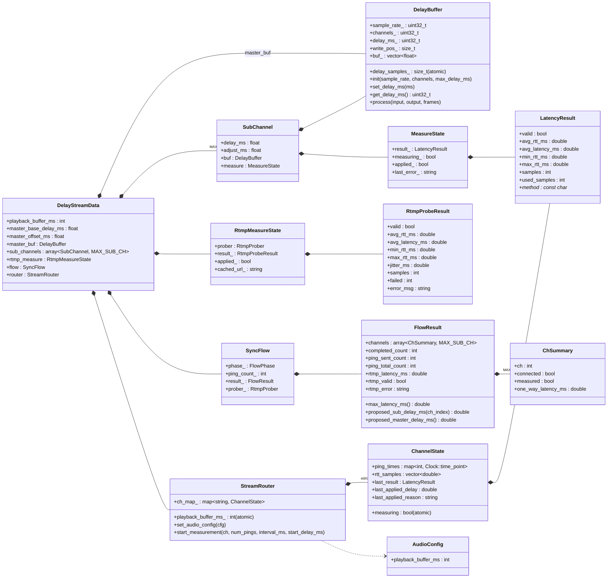

# src の時間関連主要データ構造（UML）

`src` 配下で「時間（delay / latency / RTT / playback buffer）」を扱う主要なデータ構造を、
mermaid の `classDiagram` で整理したものです。

## 補足

- `DelayStreamData` がランタイム中の時間系設定値（`master_base_delay_ms`, `master_offset_ms`, `playback_buffer_ms`）と、各機能（`SyncFlow`, `StreamRouter`, `RtmpMeasureState`）を集約します。
- 実際の音声遅延適用は `DelayBuffer`（`master_buf` と各 `SubChannel::buf`）で行われます。
- 計測値は WebSocket 側が `LatencyResult`、RTMP 側が `RtmpProbeResult`、最終的な提案値集約が `FlowResult` です。
